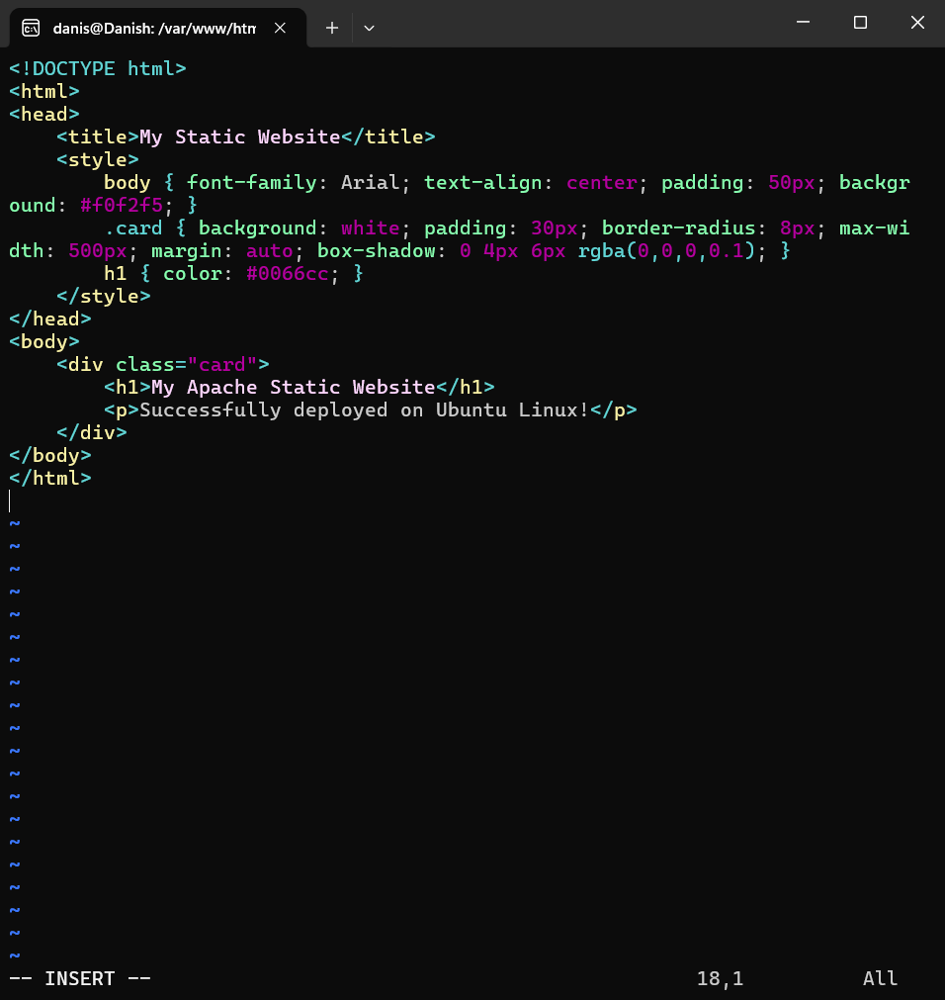
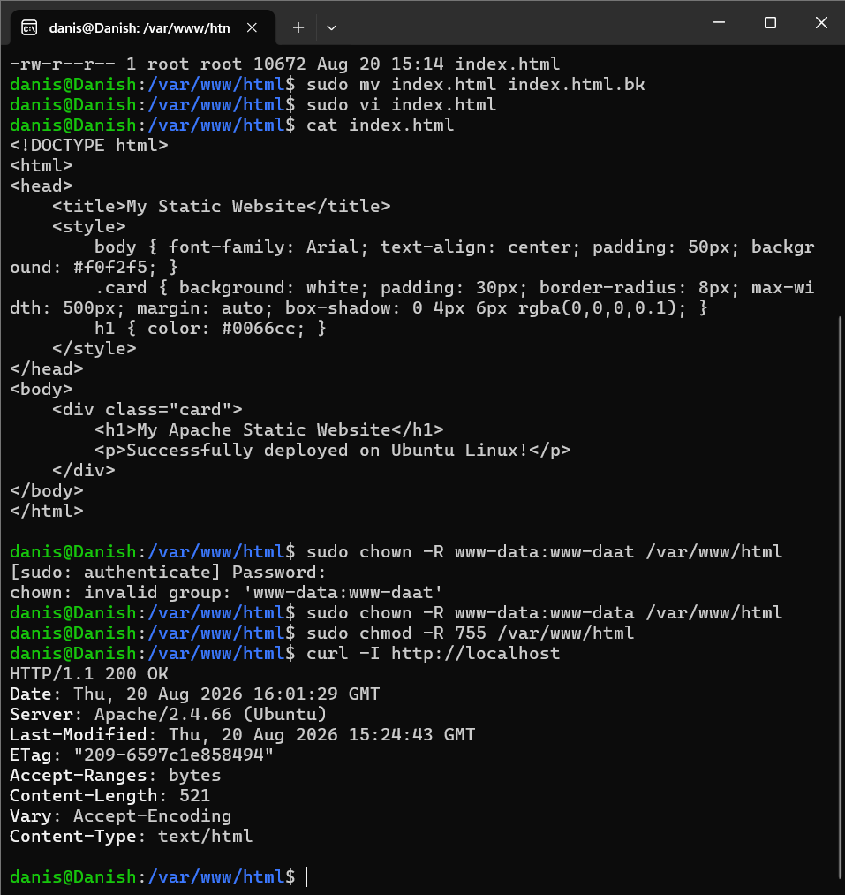
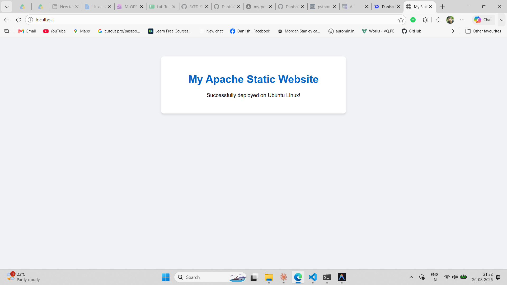

# Setup Static Apache HTML Website

## Objective

To install and configure the Apache HTTP Web Server (`apache2`) on Ubuntu/Linux, deploy a custom static HTML website in the web root directory (`/var/www/html`), manage server permissions and firewall rules, and verify the website via terminal commands and a web browser.

## Prerequisites

- Ubuntu / Debian-based Linux system
- Terminal access
- Non-root user with `sudo` privileges
- Internet connectivity for package downloads
- Web browser or `curl` utility for verification

---

## Commands Used

### 1. Update Package Index

```bash
sudo apt update
```

Refreshes the local package index to ensure the latest versions and package metadata are fetched from Ubuntu repositories.

### 2. Install Apache2 Web Server

```bash
sudo apt install apache2 -y
```

Downloads and installs the Apache HTTP Server package along with its necessary dependencies.

### 3. Check Apache Service Status

```bash
sudo systemctl status apache2
```

Checks whether the Apache service is actively running and enabled on boot.

### 4. Enable and Start Apache Service (If Not Running)

```bash
sudo systemctl enable apache2
sudo systemctl start apache2
```

Ensures that Apache starts automatically at system boot and immediately starts the service.

### 5. Configure Firewall (UFW)

```bash
sudo ufw allow 'Apache'
sudo ufw status
```

Allows incoming HTTP traffic on port `80` through the Uncomplicated Firewall (UFW).

### 6. Navigate to Web Root Directory

```bash
cd /var/www/html
```

Changes the current directory to Apache's default web document root directory.

### 7. Backup Default Apache Index Page

```bash
sudo mv index.html index.html.bk
```

Renames the default Apache welcome page to preserve it as a backup before creating a new custom webpage.

### 8. Create Custom Static HTML Page

```bash
sudo tee /var/www/html/index.html << 'EOF'
<!DOCTYPE html>
<html lang="en">
<head>
    <meta charset="UTF-8">
    <meta name="viewport" content="width=device-width, initial-scale=1.0">
    <title>My Static Website | Apache Lab</title>
    <style>
        body {
            font-family: Arial, sans-serif;
            background: #f4f6f9;
            color: #333;
            text-align: center;
            padding: 50px;
        }
        .container {
            background: #fff;
            padding: 30px;
            border-radius: 10px;
            box-shadow: 0 4px 8px rgba(0,0,0,0.1);
            max-width: 600px;
            margin: auto;
        }
        h1 { color: #007acc; }
        p { font-size: 18px; line-height: 1.6; }
        .badge {
            display: inline-block;
            background: #28a745;
            color: white;
            padding: 6px 12px;
            border-radius: 5px;
            font-size: 14px;
        }
    </style>
</head>
<body>
    <div class="container">
        <h1>Welcome to My Static Website!</h1>
        <span class="badge">Apache2 Running</span>
        <p>This static HTML website is hosted on an Apache HTTP web server configured on Ubuntu Linux.</p>
        <hr>
        <p><strong>Lab:</strong> 17 - Setup Static Apache HTML Website</p>
    </div>
</body>
</html>
EOF
```

Creates and writes a modern custom static HTML page into `/var/www/html/index.html`.

### 9. Set Ownership and Permissions

```bash
sudo chown -R www-data:www-data /var/www/html
sudo chmod -R 755 /var/www/html
```

Assigns ownership to the Apache service user (`www-data`) and sets standard read/execute directory permissions (`755`).

### 10. Verify Website Locally via CLI

```bash
curl -I http://localhost
```

Fetches the HTTP response headers to confirm `HTTP/1.1 200 OK` status.

```bash
curl http://localhost
```

Fetches and prints the HTML content of the deployed website in the terminal.

---

## Step-by-Step Walkthrough

### Step 1 — Update Package Repository Information
Ran `sudo apt update` to refresh the package cache.

```bash
sudo apt update
```

### Step 2 — Install Apache2
Installed Apache2 using the `apt` package manager:

```bash
sudo apt install apache2 -y
```

### Step 3 — Verify and Manage Apache Service
Checked the service state:

```bash
sudo systemctl status apache2
```

Confirmed that Apache status shows **`active (running)`**.

### Step 4 — Configure Firewall Rules
Allowed HTTP traffic through the firewall:

```bash
sudo ufw allow 'Apache'
sudo ufw status
```

### Step 5 — Deploy Custom HTML Website
1. Navigated to `/var/www/html`:
   ```bash
   cd /var/www/html
   ```
2. Backed up the default index page:
   ```bash
   sudo mv index.html index.html.bk
   ```
3. Created a new custom `index.html` file using `nano` or `tee`.
4. Applied appropriate permissions:
   ```bash
   sudo chown -R www-data:www-data /var/www/html
   sudo chmod -R 755 /var/www/html
   ```

### Step 6 — Test and Verify
1. Tested HTTP response using `curl`:
   ```bash
   curl -I http://localhost
   ```
2. Opened a web browser and navigated to:
   - `http://localhost` (or `http://<server-ip>`)
   The custom static HTML website rendered successfully.

---

## Screenshots

### 1. Apache Installation & Service Status

The screenshot below shows the installation of `apache2` and verification of the active service status using `systemctl status apache2`.



### 2. Custom HTML Deployment & Terminal Verification

The screenshot below shows the creation of `index.html` in `/var/www/html` and HTTP header testing with `curl -I http://localhost`.



### 3. Website Browser Output

The screenshot below shows the static website running live on port 80 in the web browser.



---

## Common Errors & Fixes

### Error 1: Port 80 Already in Use (`Address already in use: AH00072`)

**Cause:** Another service (like Nginx, Lighttpd, or an existing process) is occupying port 80.  
**Fix:** Find the process holding port 80 and stop it:
```bash
sudo ss -tulpn | grep :80
sudo systemctl stop nginx
sudo systemctl restart apache2
```

### Error 2: 403 Forbidden Error

**Cause:** Incorrect file ownership or directory permissions in `/var/www/html`.  
**Fix:** Reset ownership and permissions:
```bash
sudo chown -R www-data:www-data /var/www/html
sudo chmod -R 755 /var/www/html
```

### Error 3: Firewall Blocking Inbound Traffic

**Cause:** UFW is active and blocking incoming requests on port 80.  
**Fix:** Allow Apache through UFW:
```bash
sudo ufw allow 'Apache'
sudo ufw reload
```

---

## Key Learnings

- **Apache2 HTTP Server:** Standard and widely used web server on Linux distributions.
- **Document Root (`/var/www/html`):** The primary directory where static web files (HTML, CSS, JS, images) are served by default.
- **Service Management (`systemctl`):** Starting, enabling, checking status, and restarting system services in Linux.
- **Web User (`www-data`):** The default system user and group under which the web server runs on Debian/Ubuntu.
- **Verification (`curl`):** CLI tool to inspect HTTP response codes and headers (`200 OK`, `403 Forbidden`, `404 Not Found`).

---

## Result

The Apache HTTP server was successfully installed and configured on Ubuntu Linux. A custom static HTML website was deployed to `/var/www/html` and verified working both through terminal utilities (`curl`) and web browser access on port 80.
