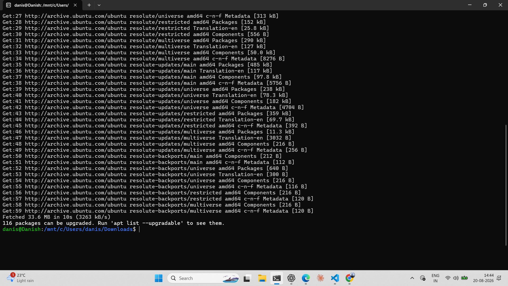
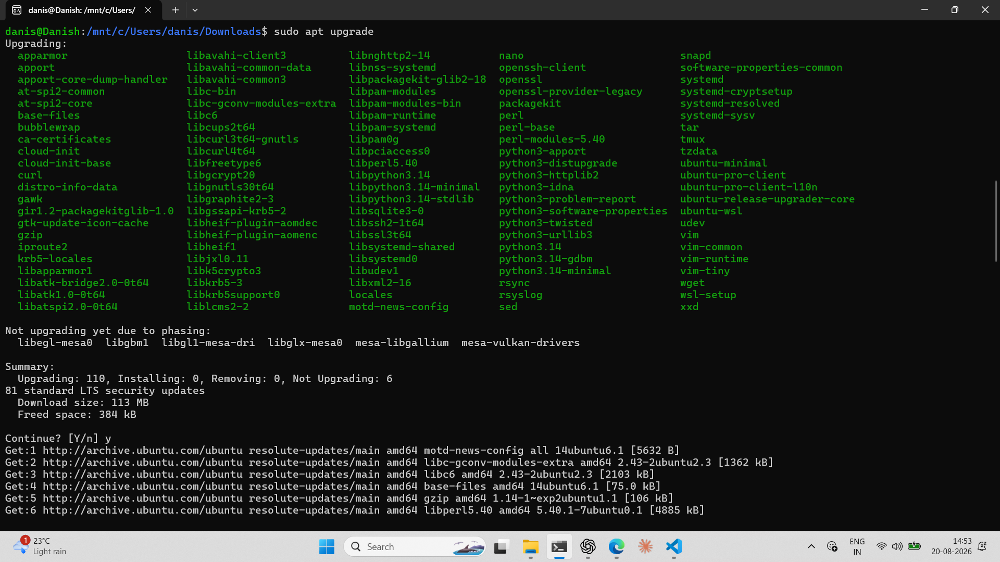

# linux-system-administration-labs
Hands-on Linux system administration labs covering package management, system configuration, file management, networking, shell scripting, and practical troubleshooting.
# Linux Update & Upgrade Commands

## Objective

To update the local package repository information and upgrade installed packages on Ubuntu using the APT package management system.

## Prerequisites

- Ubuntu Linux system
- Internet connection
- User account with `sudo` privileges
- APT package manager

## Commands Used

### 1. Update Package Information

```bash
sudo apt update
```

**Purpose:** Refreshes the local package index by retrieving the latest package information from the configured Ubuntu repositories.

**Note:** This command checks for available updates but does not install them.

### 2. Upgrade Installed Packages

```bash
sudo apt upgrade
```

**Purpose:** Installs available updates for packages already installed on the system.

## Step-by-Step Walkthrough

### Step 1 — Update Package Repository Information

The package lists were refreshed using:

```bash
sudo apt update
```

The command completed successfully and reported available package updates.

### Step 2 — Upgrade Installed Packages

The available package updates were installed using:

```bash
sudo apt upgrade
```

The command completed successfully and upgraded the required packages.

## Screenshots

### 1. APT Update

The following screenshot shows the execution and successful output of `sudo apt update`.



### 2. APT Upgrade

The following screenshot shows the execution and successful output of `sudo apt upgrade`.



## Key Learnings

- `apt update` refreshes the local package information.
- `apt upgrade` installs available updates for installed packages.
- `sudo` provides the required administrative privileges.
- Updating package information should normally be performed before upgrading packages.
- APT is the package management system used by Ubuntu and other Debian-based Linux distributions.

## Common Errors & Fixes

### Error: Permission denied

**Cause:** The command was executed without administrative privileges.

**Fix:**

```bash
sudo apt update
```

or

```bash
sudo apt upgrade
```

### Error: Could not resolve host

**Cause:** The Linux system may not have working internet or DNS connectivity.

**Fix:** Check the internet connection and DNS configuration, then run the command again.

### Error: Package lists could not be retrieved

**Cause:** A repository may be temporarily unavailable or incorrectly configured.

**Fix:** Check the repository configuration and retry:

```bash
sudo apt update
```

## Result

The Ubuntu package repository information was successfully updated and the available installed-package upgrades were successfully applied.
